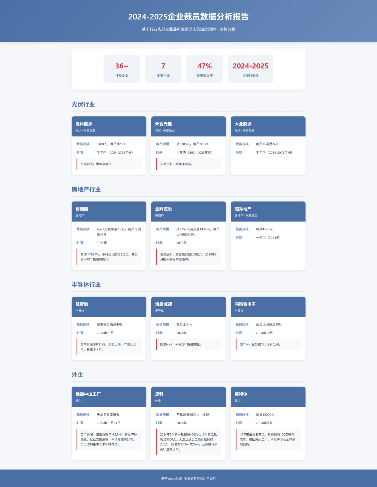
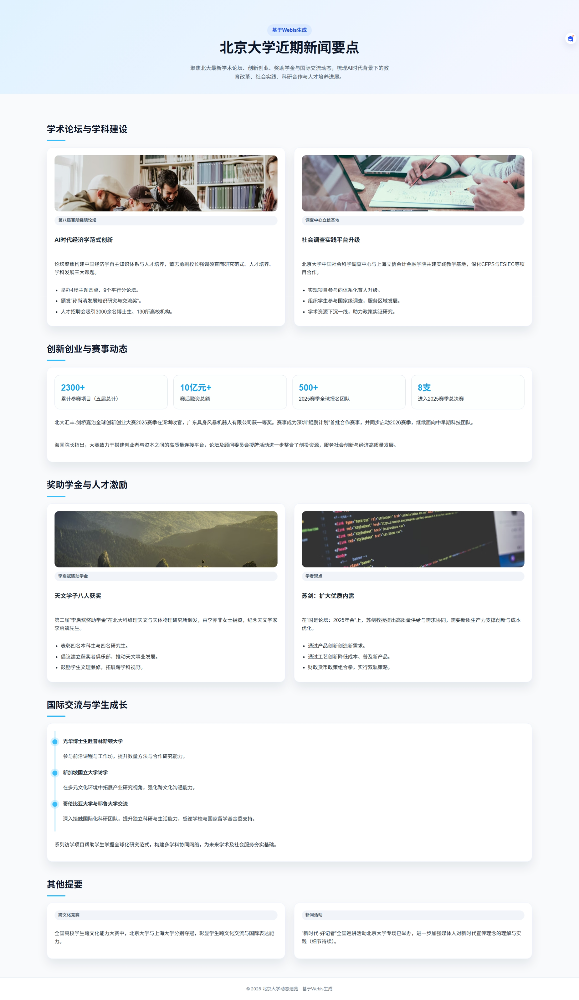

#  Webis-从网络数据抓取到专题知识库构建的高效流水线

[English](README.md) | [中文](README_CN.md)

  


## 项目概述

**Webis**是一个强大的端到端数据处理平台，结合了**大语言模型（LLM）** 技术，旨在为用户提供一个高效、自动化的**数据处理流水线**。这个平台可以帮助用户快速抓取非结构化的网络数据、清洗数据并进行结构化输出，生成JSON、Markdown等格式的专题知识库，并将专题知识库可视化为HTML网页。

在当今信息爆炸的时代，海量的数据和信息随时都在产生，传统的数据处理方式通常耗时长、效率低。Webis通过智能化流水线的设计，极大地提高了数据获取、清洗和结构化的效率，并且具备**可定制化**、**灵活扩展**的能力，能够快速适应不同的应用场景。

---

## 目录

1. [项目概述](#项目概述)
2. [核心特点](#核心特点)
3. [快速开始](#快速开始)
   * [系统要求](#系统要求)
   * [安装步骤](#安装步骤)
   * [配置 API Key](#配置-api-key)
4. [主要目录结构](#主要目录结构)
5. [使用](#使用)
   * [命令行接口说明](#命令行接口说明)
   * [执行产物与目录结构](#执行产物与目录结构)
   * [示例 1：抓取中国企业裁员信息](#示例-1抓取中国企业裁员信息)
   * [示例 2：整理北京大学近期新闻](#示例-2整理北京大学近期新闻)
6. [开发与拓展](#开发与拓展)
7. [贡献](#贡献)   

---

## 核心特点

* 🧠 **智能数据处理与结构化抽取**
  Webis提供了三阶段的流水线：**数据获取 → 文本清洗 → 数据结构化**，可对从新闻、报告、文章中获取的内容进行深度挖掘，并生成结构化知识库，如 JSON、Markdown 格式报告等。

* 🖼️ **结构化结果可视化为网页**
  Webis会将三阶段流水线生成的结构化文本自动构建为可视化网页，方便直接浏览和分享。

* 🔄 **插件化架构，支持灵活扩展**
  系统内置多种数据源接口，支持自定义数据获取工具、格式解析器等插件，可按需扩展，适配不同的数据来源和格式。

* 🌐 **多领域应用示例**
  Webis支持不同领域的数据抓取与处理，以下是两个典型应用示例：

  * **企业情况分析**：用户可请求抓取国内企业裁员数据并生成结构化报告。例如，从国内多家知名企业（如 **晶科能源**、**天合光能** 等）获取裁员情况，输出涉及裁员规模、时间、行业背景等信息。

  * **学术新闻与活动报告生成**：例如，针对 **北京大学** 的近期新闻，系统能够自动抓取学术活动、创新创业大赛、奖学金颁发等信息，并整理成结构化报告，提供便捷的新闻概要和学术活动概览。

---

## 快速开始

### 🧩 系统要求

* Python **3.9 或 3.10**
* 支持 **Conda** 或 **UV** 环境管理
* Git 克隆访问
* LLM API Key（如 SiliconFlow / DeepSeek）

### 🛠️ 安装步骤

1. **通过 Conda 安装**

   ```bash
   git clone https://github.com/Easonnoway/webis-dev.git
   cd webis-dev
   bash setup/conda_setup.sh
   conda activate webis
   ```

2. **通过 UV 安装**

   ```bash
   git clone https://github.com/Easonnoway/webis-dev.git
   cd webis-dev
   bash setup/uv_setup.sh
   source webis/bin/activate
   ```

### 🔑 配置 API Key
####  主要LLM API密钥

- `SILICONFLOW_API_KEY` (推荐) 或 `DEEPSEEK_API_KEY` (兼容)

####  可选的爬虫工具API密钥

- 系统会根据可用密钥自动选择工具，缺少密钥的工具不会被使用

- 新闻搜索

  - `GNEWS_API_KEY` - 用于 GNewsTool 新闻搜索
  - `SERPAPI_API_KEY` - 用于 SerpApi Google 搜索
  - `BAIDU_AISEARCH_BEARER` - 用于百度千帆AI搜索

- 代码库搜索

  - `GITHUB_TOKEN` - 用于 GitHub 搜索

确保在 `.env.local` 或 `.env` 文件中配置了 LLM API Key：

```env
# 必要
SILICONFLOW_API_KEY=your_key_here
# 可选
GNEWS_API_KEY=your_key_here
SERPAPI_API_KEY=your_key_here
BAIDU_AISEARCH_BEARER=your_key_here
GITHUB_TOKEN=your_token_here
```

---

## 主要目录结构

```
webis-dev/
├── crawler/                 # 数据源接口
├── tools/                   # 文件类型处理器
├── structuring/             # 提示与抽取模块
├── setup/                   # 安装与依赖脚本
├── webis_pipeline.py        # 主执行入口
├── README.md
├── .env.local
└── pipeline_outputs/        # 运行输出目录
```

---

## 使用

### 🧑‍💻 命令行接口说明
Webis提供了一组命令行参数来控制任务执行。以下是主要参数说明：

| 参数      | 类型 | 默认值                         | 说明                                        |
| ----------- | ---- | ------------------------------- | -------------------------------------------------- |
| `task`      | str  | (required)                      | Natural language task for crawling and structuring |
| `--limit`   | int  | `5`                             | Maximum number of items to crawl                   |
| `--out`     | str  | `pipeline_outputs/<timestamp>/` | Custom output directory                            |
| `--verbose` | flag | `False`                         | Enable detailed logging                            |
| `--workers` | int  | `4`                             | Parallel workers for text extraction               |

### 📁 执行产物与目录结构

执行完毕后，所有产物会按照时间戳保存在输出目录中，如下所示：

```
pipeline_outputs/
└── <timestamp>/                    # Run ID (Unix timestamp)
    ├── manifest.json               # Complete execution metadata
    ├── crawl_files.json           # List of acquired files
    ├── texts/                     # Cleaned text files
    │   ├── 0001_filename1.txt
    │   ├── 0002_filename2.txt
    │   └── ...
    └── structured/                # Final structured output
        ├── prompt.txt             # Generated extraction prompt
        └── result.{json|md}       # Structured result
```

### 🧑‍💻 示例 1：抓取中国企业裁员信息

用户可以请求获取并分析 **中国企业的裁员情况**，并输出结构化报告，包含公司名称、裁员规模、时间等。示例命令如下：

```bash
python webis_pipeline.py "查看中国国内企业最近的裁员情况，以结构化形式给我" --limit 10 --verbose
```

**输出结果(截取部分)：**

```
[
  {
    "company_name": "晶科能源",
    "industry": "光伏",
    "layoff_scale": "5400人，裁员率16%",
    "layoff_time": "半年内（2024-2025年间）",
    "notes": "头部企业，半年净减员。"
  },
  {
    "company_name": "天合光能",
    "industry": "光伏",
    "layoff_scale": "近5100人，裁员率17%",
    "layoff_time": "半年内（2024-2025年间）",
    "notes": "头部企业，半年净减员。"
  },
  {
    "company_name": "大全能源",
    "industry": "光伏",
    "layoff_scale": "裁员率逼近24%",
    "layoff_time": "半年内（2024-2025年间）",
    "notes": "头部企业。"
  },
  {
    "company_name": "安徽某龙头企业",
    "industry": "光伏",
    "layoff_scale": "鼓励员工离职",
    "layoff_time": "自12月起停产5个月",
    "notes": "自12月起停产5个月，鼓励员工离职。"
  },
  {
    "company_name": "浙江HJT企业",
    "industry": "光伏",
    "layoff_scale": "从300人裁到30人",
    "layoff_time": "2024-2025年",
    "notes": "“上一休一”“停产排休”成行业标配。"
  }
]
```
**可视化网页效果：**

<details>
  <summary>点击查看图片</summary>
  
</details>


### 🧑‍💻 示例 2：整理北京大学近期新闻

用户可请求将 **北京大学的最新新闻** 整理成报告格式，涵盖学术活动、创新创业大赛等重要事项。示例命令如下：

```bash
python webis_pipeline.py "把北京大学最近的新闻整理成一个报告" --limit 10 --verbose
```

**输出结果：**

<details>
<summary>点击查看报告</summary>

````markdown
**关于北京大学近期新闻的报告**

根据提供的文本，以下是对北京大学近期主要新闻事件的整理报告：

**一、 学术论坛与学科建设**

1.  **第八届“中国百所大学经济学院院长论坛”暨“百所经院人才招聘会”**
    *   **主题：** AI时代的经济学教育与研究范式创新。
    *   **时间：** 12月12日至14日。
    *   **地点：** 北京大学经济学院。
    *   **主要参与机构/人物：** 北京大学经济学院主办；北京大学副校长董志勇出席并致辞；全国百余所大学经济学院院长参与。
    *   **核心内容/观点：** 论坛聚焦AI时代经济学面临的挑战与机遇，围绕构建中国经济学自主知识体系、创新教学研究、锚定“十五五”规划、筑牢人才培养根基等议题展开研讨。董志勇副校长指出需直面研究范式、人才培养、学科发展三大课题，呼吁学界以开放创新精神共谱发展新篇章。
    *   **相关活动与成果：**
        *   举办了四场主题圆桌论坛和九个平行分论坛。
        *   举行了“孙尚清发展知识研究与交流奖”颁奖仪式，英国剑桥大学教授彼得·诺兰获卓越成就奖，浙江大学教授龚斌磊获青年学者奖。
        *   同期举办的“百所经院人才招聘会”吸引了海内外3000余名博士生与全国130所高校及科研机构对接。

2.  **北大调查中心立信实践教学基地在沪成立**
    *   **事件：** “北京大学中国社会科学调查中心立信实践教学基地”揭牌成立。
    *   **时间：** 近日（具体日期未明确）。
    *   **地点：** 上海（上海立信会计金融学院）。
    *   **主要参与机构：** 北京大学中国社会科学调查中心、上海立信会计金融学院。
    *   **核心内容/意义：** 该基地标志着双方合作从项目参与（如“中国家庭追踪调查CFPS”、“中国企业创新创业调查ESIEC”）升级为体系化育人。未来将深化实践教学、科研协同、人才输送合作，组织学生参与国家级调查项目，对接区域发展需求，为政策制定提供实证参考。北京大学企业大数据研究中心主任张晓波认为，这是学术资源下沉育人一线的创新尝试。

**二、 创新创业与大赛活动**

1.  **2025北大汇丰-剑桥嘉治全球创新创业大赛收官**
    *   **事件：** 北大汇丰-剑桥嘉治全球创新创业大赛2025赛季总决赛暨北大-剑桥湾区创业创投论坛。
    *   **时间：** 日前（具体日期未明确，报道发布于12月13日）。
    *   **地点：** 北京大学汇丰商学院。
    *   **主要参与机构/人物：** 北京大学汇丰商学院、剑桥大学嘉治商学院；北京大学原副校长、汇丰商学院创院院长海闻，英国驻广州总领事孟诗然等出席。
    *   **核心内容/成果：**
        *   8支团队进入总决赛，广东具身风暴机器人有限公司获一等奖。
        *   大赛2026赛季同期启动，将继续关注中早期科技团队。
        *   大赛已举办五届，累计收到超2300个项目，覆盖全球7个国家和地区，赛后融资总额超10亿元。2025赛季成为深圳市“鲲鹏计划”首批合作赛事，收到全球超500个团队报名。
        *   海闻院长指出大赛旨在搭建连接创业者与资本的高质量平台，服务社会创新与经济发展。
        *   期间还举行了创业创投论坛和创业创投顾问委员会新增委员授牌仪式。

**三、 奖项颁发与捐赠助学**

1.  **2025年度第二届“李启斌奖助学金”颁奖仪式举行**
    *   **事件：** “李启斌奖助学金”颁奖仪式。
    *   **时间：** 2025年12月7日。
    *   **地点：** 北京大学科维理天文与天体物理研究所。
    *   **主要参与人物/机构：** 李启斌基金会理事长李亦非女士（捐资方）、北京大学物理学院天文学系师生代表（张华伟教授、吴学兵教授等）。
    *   **核心内容/意义：**
        *   该奖助学金由李亦非女士捐资设立，旨在纪念天文学家李启斌先生，培育天文领域后备人才。
        *   本届共有八名天文学科优秀本研学生获奖（四名本科生、四名研究生）。
        *   李亦非女士致辞回顾了父亲李启斌先生的科研奉献精神，强调基础科学及天体物理研究的重要性，鼓励学生文理兼修、拓展跨学科视野，并倡议建立获奖者俱乐部以共促中国天文事业发展。
        *   获奖学生代表表达了对基金会及学校的感谢，承诺将传承科学精神，潜心治学。

**四、 学者观点与学术交流**

1.  **学者观点：苏剑教授谈扩大优质内需**
    *   **人物：** 北京大学经济学院教授苏剑。
    *   **场合：** “国是论坛：2025年会”。
    *   **核心观点：** 经济高质量增长依赖高质量需求，扩大优质内需的关键在于发展新质生产力。具体路径包括通过产品创新创造新供给带动新需求，以及通过工艺创新降低成本普及新产品。需要财政与货币政策配合形成“组合拳”，采用“稳住经济大盘”与“扩大优质需求”的双轨策略，以实现经济质的有效提升和量的合理增长。

2.  **学生海外访学交流（光华管理学院博士生）**
    *   **概况：** 文本提及多位北京大学光华管理学院的博士生分享其在美国普林斯顿大学、新加坡国立大学、哥伦比亚大学、耶鲁大学等多所海外高校的访学经历与收获。
    *   **核心内容：** 学生们普遍表示，访学经历拓宽了国际视野，接触了学术前沿，提升了研究能力与独立生活能力，并在跨文化交流与合作中获得了成长。他们感谢学校、导师及国家留学基金委的支持。

**五、 其他提及事项（信息不完整）**

*   文本简要提及“全国高校学生跨文化能力大赛”中北京大学与上海大学分别夺冠，但无详细内容。
*   文本标题提及“新时代·好记者”全国巡讲活动北京大学专场举行，但正文内容缺失。
*   文本末尾部分包含大量无关的日期列表、标签和重复标题，未提供关于北京大学的有效新闻信息。

**总结：**
近期，北京大学在学术研讨、学科交叉实践、创新创业教育、奖助学金设立以及学者观点输出等方面活动频繁。主要聚焦于应对AI时代的经济学教育变革、深化社会调查的产学研合作、搭建国际化创新创业平台、鼓励基础科学研究和扩大学术国际交流。这些活动体现了北京大学在推动学科发展、人才培养、社会服务与国际合作方面的持续努力。
````

</details>

<br>

**可视化网页效果：**
<details>
  <summary>点击查看图片</summary>
  
</details>

---
## 开发与拓展
### 🛠️ 扩展数据获取工具

Webis的数据获取组件遵循统一的插件规范，只需实现 **BaseTool 接口** 即可添加新的数据源支持。自定义工具需要：

1. 定义工具元数据（名称、描述、能力等）。
2. 实现关键的 `run(task, **kwargs)` 方法，返回标准化的抓取结果。
3. 将工具注册到系统爬虫代理（Agent）中以供调度使用。

这种设计确保了不同爬虫实现之间的一致性，并可灵活替换或组合不同策略抓取网络内容。

### 📄 扩展文件处理器

所有文件处理逻辑（如 HTML、PDF、图像 OCR 等）也都采用插件形式。自定义处理器需要：

- 实现 `BaseFileProcessor` 类并定义支持的文件扩展名；
- 实现 `extract_text()` 方法提取文本内容；
- 返回包含标准字段的结果（如 `success`、`text`、`meta` 等）。

这样一来就可以轻松添加对新文件类型或特定清洗策略的支持。

---
## 贡献

欢迎贡献！请在 GitHub上提交问题或拉取请求。如需支持，请通过 GitHub Issues 联系我们。